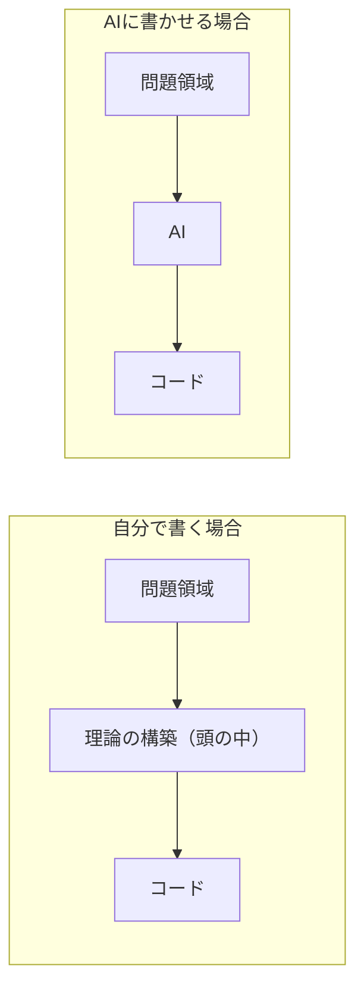

## はじめに

Claude Code のようなAIコーディングツールを日常的に使っている。開発の速度は明らかに上がったし、いまさら手放す気もない。最初に書いておくと、この記事はAI否定論ではない。

そのうえで、最近ずっと引っかかっていることがある。

自分のプロダクトなのに、構造が頭に入っていない。修正が必要になるたびに、自分のリポジトリのコードを読み直している。AIにPRを細かく分けて出させて、一つずつ読まないと、これは自分が作ったものだという感覚が保てない。コードは増えているのに、理解が増えていない。

この感覚をうまく説明できずにいたのだが、調べているうちに、40年前の論文がほぼそのまま説明していることを知った。Peter Naur の "Programming as Theory Building"（1985）である。本記事では、この論文を補助線にして、AIにコードを書かせると理解が頭に残らない理由を整理する。

## Programming as Theory Building

Peter Naur は BNF（Backus-Naur form）の Naur であり、2005年のチューリング賞受賞者である。その Naur が1985年に書いたのがこの論文で、主張を一言でまとめるとこうなる。

**プログラミングの本体は、コードを書くことではなく「理論（theory）」を構築することである。**

ここでいう理論とは、開発者の頭の中にある次のような知識を指す。

- 現実の問題領域と、コードの各部分がどう対応しているか
- なぜ他の設計ではなく、この設計を選んだのか
- どこを変えると、どこに影響が出るか

そのうえで Naur は次のように主張する。

1. プログラムの本体はソースコードではなく、開発者の中にある理論である
2. 理論はドキュメントに書き切れない。コードやドキュメントは理論の出力であって、それらから理論を復元することはできない
3. プログラムを適切に修正・拡張できるのは、理論を持っている者だけである

さらに Naur は、理論を持つ開発者がいなくなったプログラムを「死んだ（dead）」と表現する。コードが完全な形で残っていても、である。死んだプログラムを引き継いだチームはコードから理論を復元できないため、修正のたびに場当たり的なパッチを重ねることになる。1985年の時点で、人間同士の引き継ぎの問題としてこれが書かれている。

## AIコーディングに当てはめる

この論文で一番重要なのは、理論が作業の成果物ではなく、**作業の過程から構築される**という点である。設計を考え、書いて、動かして、失敗して、直す。理論はこの往復の中でしか構築されない。完成したコードを受け取っても、理論は付いてこない。

AIにコードを書かせたときに起きているのは、まさにこれである。コードという成果物は得られる。しかし、理論が構築されるはずだった工程がスキップされている。

だから「AIに書かせるとコードは増えるのに理解が増えない」のは、注意力や読解力の問題ではない。理解が発生する工程をそもそも通っていないのだから、構造的に当然の帰結である。

「レビューで補えばいい」という考え方もあるし、私も実際そうしている。ただ、書いたときと読んだときでは、構築される理解の質が違うというのが実感である。読んで得られるのは「このコードが何をしているか」で、書いて得られるのは「なぜこうなっていて、どこを触るとどうなるか」である。前者は数週間で消えるが、後者はなかなか消えない。

## 自作OSでの実感

この差を一番はっきり感じているのが、趣味で作っている自作OSである。

私は自作OSにネットワーク機能を手で実装した。virtio-net（仮想NIC）からパケットを受け取り、ARP に応答し、ping に返事をするまでを、ヘッダを1バイト単位で読みながら書いた。

この部分については、いまでも大体のことが頭から答えられる。ping が通らなくなったら、チェックサムか、バイトオーダーか、受信バッファの管理か、どこから疑うべきかの当たりが最初からつく。仕様のどこを真面目に実装して、どこを妥協したかも覚えている。コードを読み直す前に、頭の中に照会できるものがある。

一方で、同じ開発の中でも、ビルドスクリプトやデバッグ用ツールなど、AIに書かせた部分がある。コードは読めるし、レビューもした。それでも、修正が必要になるたびに毎回コードを読み直している。読めば理解できるが、読む前に何も浮かばない。「どこが怪しいか」が出てこない。

この差はコードの品質の差ではない。むしろAIが書いたコードのほうが整っていることも多い。差があるのは、自分の中に理論があるかどうか、それだけである。

Naur の枠組みで言えば、手で書いた部分は理論を持つ開発者が生きているプログラムで、AIに書かせた部分は最初から理論の持ち主がいないプログラムである。生成された時点で、すでに「死んだプログラム」に近い性質を持っている。

もちろん、手で書いた部分の理論も時間が経てば薄れる。ただ、一度構築した理論はコードを読み直せば短時間で戻る。最初から構築するのとは体感がまるで違う。薄れることと、最初から無いことは別物である。

## 「わかっている」という体感が当てにならない

やっかいなのは、理論が構築されていないことに、自分では気づきにくいという点である。ここは体感の話だけでは弱いので、研究をいくつか引いておく。

METR が2025年7月に発表したランダム化比較試験では、経験豊富なOSS開発者16名に、自分がよく知っているリポジトリのタスク246件を、AIツールの使用可否を分けて割り当てた。結果、AIを使った場合のタスク完了時間は実測で19%長くなった。ところが本人たちは、終わった後に「AIのおかげで20%速くなった」と見積もっていた。体感と実測が、逆方向にずれていた。

:::message
METR 自身がこの結果を「2025年前半のツールとワークフローにおける結果」と位置づけており、ツールの進歩によって速度に関する結論は変わりうる。ここで引用したいのはAIが遅いという話ではなく、**自分の開発体験に関する体感は、実測とここまでずれる**という一点である。
:::

また、Microsoft と CMU が CHI 2025 で発表した知識労働者319名への調査では、生成AIの能力への信頼が高い人ほど、批判的思考を働かせる度合いが下がる傾向が報告されている。

これは学習の場面での実感とも一致する。講義を受動的に聞いてもほとんど頭に残らないが、先に自分で問題を解こうとしてから解説を読むとよく定着する。学習科学でテスト効果と呼ばれている現象である。AIの説明を読んで「わかった」と思ったのに翌週には何も残っていないのは、つまらない講義が頭に残らないのと同じ構造だと思っている。

## どう折り合いをつけているか

正解は持っていない。現時点でやっていることを書いておく。

まず、AIにはPRを小さく分けて出させて、一つずつ読んでから先に進める。速度は明確に落ちる。ただこれは、スキップされた理論構築の工程を、レビューという形で部分的に払い直す時間だと考えている。書いた場合の理論には及ばないが、何もしないよりはずっとましである。

次に、設計判断が集中する中核部分は自分で書く。周辺の定型的なコードやテストはAIに任せる。すべての理論を持ち続けることはどのみち不可能なので、どの部分の理論を手放すかを自分で選ぶようにしている。無自覚に手放すのと、選んで手放すのとでは、後から払うコストが違う。

AIに質問するときは、先に自分の予想を立ててから聞くようにしている。予想が当たっていれば理論の確認になるし、外れていればその差分は頭に残る。テスト効果をそのまま応用しているだけだが、効果は大きい。

それでも、「速く進める」と「理論を保つ」のトレードオフ自体が消えるわけではない。AIを使わなければ理論は保てるが、その選択は現実的ではないし、取りたいとも思わない。結局のところ、タスクごとにトレードオフのどこに立つかを選び続けている、というのが正直なところである。

## おわりに

Naur は40年前に、プログラムの本体はコードではなく開発者の中の理論だと書いた。AIはコードをくれるが、理論は自分の作業の中でしか構築されない。この非対称性は、モデルがどれだけ賢くなっても残り続けるように思う。

## 参考資料

- [Peter Naur, "Programming as Theory Building" (1985)](https://pages.cs.wisc.edu/~remzi/Naur.pdf)
- [METR, "Measuring the Impact of Early-2025 AI on Experienced Open-Source Developer Productivity" (2025)](https://metr.org/blog/2025-07-10-early-2025-ai-experienced-os-dev-study/)
- [Lee et al., "The Impact of Generative AI on Critical Thinking: Self-Reported Reductions in Cognitive Effort and Confidence Effects From a Survey of Knowledge Workers" (CHI 2025)](https://doi.org/10.1145/3706598.3713778)
